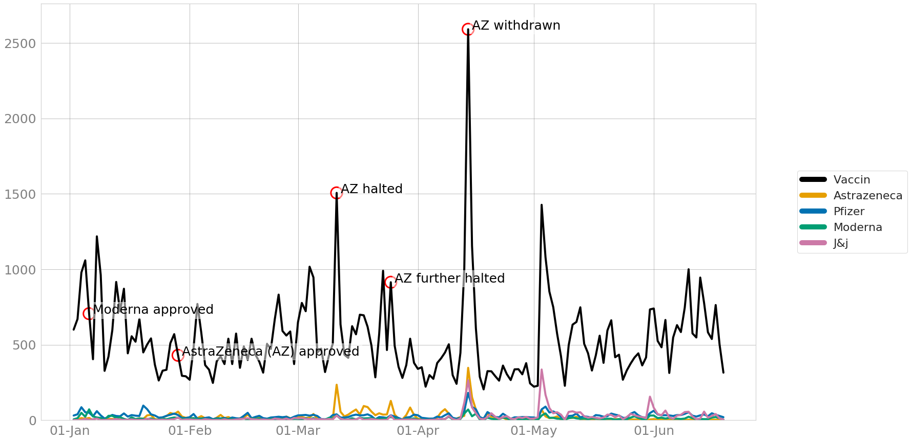

# Pipeline for querying Twitter by keyword(s)

### Author
Maris Sala
Sara Møller Østergaard
Stine Nyhus Larsen

## Examples
An example Jupyter Notebook visualizing the different parts of the code has been added. To check out how vaccines, AstraZeneca, Pfizer, and Moderna mentions are represented in Danish Twitter, check out ``notebooks/vaccines-az-pfizer-moderna.ipynb``


An example of how the mentions of vaccines overall and the 4 popular vaccines are represented in the Danish Twitter together with events from the media.

## Usage

There are two pipelines:
1. Querying Twitter for keywords (this includes the 2nd pipeline)
2. Automatically retrieving smoothed values for number of mentions over time and semantic scores over time

The first pipeline has the second implemented inside of it as well now.

### 1. Querying Twitter for keywords

Based on keywords (and possibly date specifics) this pipeline extracts tweets from our Twitter corpus where the keywords match with texts.
Queries are created by adding an entry in the .ini config file. 
What should be provided is

[key] (what the query entry should be called - either same as first query term or name)
keywords = keyword1,keyword2 (keyword separated only by comma, not space - spaces within keywords are created with ~, such as mette~f)
from_date = yyyy-mm-dd (date for when quering should start)
to_date = yyyy-mm-dd/None (date for when quering should end - if not provided, all tweets after from_date are used)
test_limit = ???
small = bool (True or False - wether or not the query is big. So far, only corona and vaccine are big)

```bash
nohup bash src/pipeline.sh -k keyword1,keyword2 -f 2020-12-01 -t 2020-12-30 -s True &> logs/keyword1_[today's_date].log &

```
Use "bash" and *not* "sh"!
Nohup allows for the code to run in the background while freeing up the terminal. It also saves the logs into the logs/ folder where one can later see statistics about the dataset as well as what might have gone wrong and where.

If to-date is not specified, the code queries for data up until the latest dates. If a file on this keyword query already exists, the code queries for data starting from the latest date that exists in the pre-made dataset to save time.

Usage without nohup:
```bash
bash src/pipeline.sh -k keyword1,keyword2 -f 2020-12-01 -t 2020-12-30

```

| Flag  | Meaning  | Format  | Example1  | Example2  |
|---|---|---|---|---|
| -k  | Keyword(s) to query  | keyword1,keyword2  | covid  | covid,dkpol  |
| -f  | From date: if one wants to specify date range  | YEAR-MONTH-DAY  | 2020-01-01  | 2020-12-02  |
| -t  | To date: if one wants to specify date range  | YEAR-MONTH-DAY  | 2020-01-30  | 2020-12-20  |
| -s  | Small or not: most datasets are small (100-500 tweets per day), use False when it's a large dataset (1000-more tweets per day). This is used for setting the parameters for Gaussian smoothing. Produces two types of smoothing plots (smoother and less smoother, so that smoothing can be done automatically)  | True/False | True | False |
| -l  | Test with limit: to speed up testing, samples only from data of this year/month/day  | YEARMONTHDAY  | 202001  | 20201220 |

NOTE: the **first** keyword entered is also used to prefix the data files and figures!

### If keywords are special: contain hashtags, spaces

#### Hashtags

```bash
bash src/pipeline.sh -k ~#keyword1,keyword2 -f 2020-12-01 -t 2020-12-30

```
Trail the 1st hashtag with ~

#### Words with spaces

```bash

bash src/pipeline.sh -k key~word1,keyword2 -f 2020-12-01 -t 2020-12-30

```
Replace space with ~


## Description of steps in the main pipeline
1. Extract data
```bash
source /home/commando/maris/bin/activate
python extract_data.py $*
```
Extracts data from ```'/data/001_twitter_hope/preprocessed/da/*.ndjson'``` - this includes all preprocessed Danish Twitter data. Creates a file with matches with keywords per file and saves them to ``tmp_keyword/`` folder which it creates itself (allows for running the code for different keywords simultaneously because each keyword query uses a separate data folder).

2. Join files
```bash
python join_files.py $*
```
Joins together all files starting with keyword1 in the data folder, joins them together as ``keyword1_data.csv``. Deletes all the keyword files and the created temporary data folder to reduce taking up space.

3. Preprocess stats
```bash
python preprocess_stats.py $*
```
Preprocesses the data: cleans tweets from mentions, hashtags, emojis, URLs (adds a cleaned tweet column, keeps the original tweet intact). Removes quote tweets from the data set. Outputs statistics. These are captured in the ``src/logs/``. Outputs ``keyword1_data_pre.csv``

4. Semantic scores
```bash
source /home/commando/covid_19_rbkh/Preprocessing/text_to_x/bin/activate
python semantic_scores.py $*
```
Calculates semantic scores with Danish Vader for the cleaned tweets. Outputs ``keyword1_vis.csv``

5. Smoothing
```bash
source /home/commando/maris/bin/activate
python smooth_and_entropy.py $*
```
Gaussian smoothing on number of tweets per day and compound scores (can calculate entropy as well). Good for clarifying the visuals.

6. Visualize
```bash
python visualize.py $*
```
Creates initial visuals: keyword mentions frequency over time, compound sentiment over time, frequent hashtags, frequent words, wordcloud, bigram graphs with k varying between 1 and 5. Saves to ``fig/``

NOTE: if the file for the specific keyword search has already been conducted, the code first checks whether that is true, and only adds the data for new incoming dates, instead of rerunning extraction and preprocessing on all of the data.

### 2. Automatically retrieving smoothed values for number of mentions over time and semantic scores over time

```bash
nohup bash src/gaussian_smoothing.sh -k keyword1,keyword2 -f 2020-12-01 &> logs/keyword1_smooth.log &

```
The pipeline only consists of ``smooth_and_entropy.py`` which does the following:
1. Centers sentiment compound scores
2. Retrievs entropy of centered compound per day
3. Centers entropy
4. Calculates smoothed entropy and sentiment scores

Outputs ``keyword1_smoothed.csv``.
